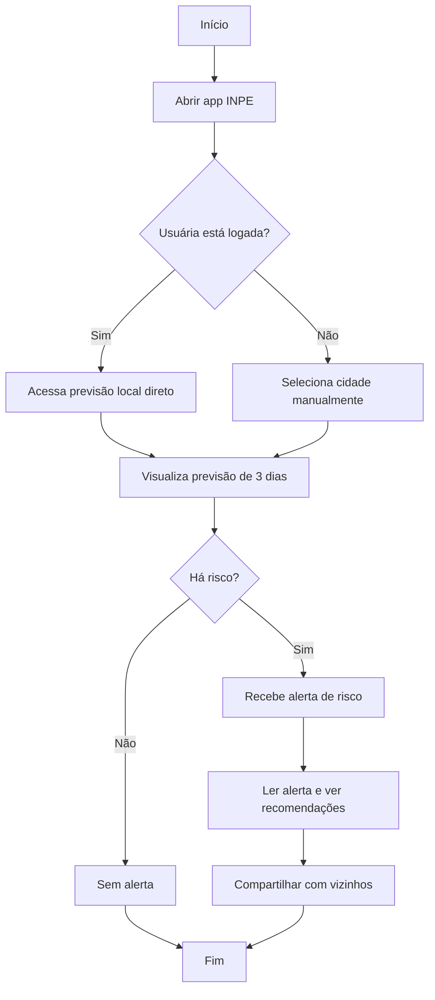

# Exercício 2 — Fluxo com decisão alternativa
**Objetivo:** Consultar previsão do tempo + receber alerta se houver risco (Persona: Ana).

```mermaid
flowchart TD
    A[Início] --> B[Abrir app INPE]
    B --> C{Usuária está logada?}
    C -- Sim --> D[Acessa previsão local direto]
    C -- Não --> E[Seleciona cidade manualmente]
    D --> F[Visualiza previsão de 3 dias]
    E --> F[Visualiza previsão de 3 dias]
    F --> G{Há risco?}
    G -- Sim --> H[Recebe alerta de risco]
    G -- Não --> I[Sem alerta]
    H --> J[Ler alerta e ver recomendações]
    J --> K[Compartilhar com vizinhos]
    I --> L[Fim]
    K --> L[Fim]
```
