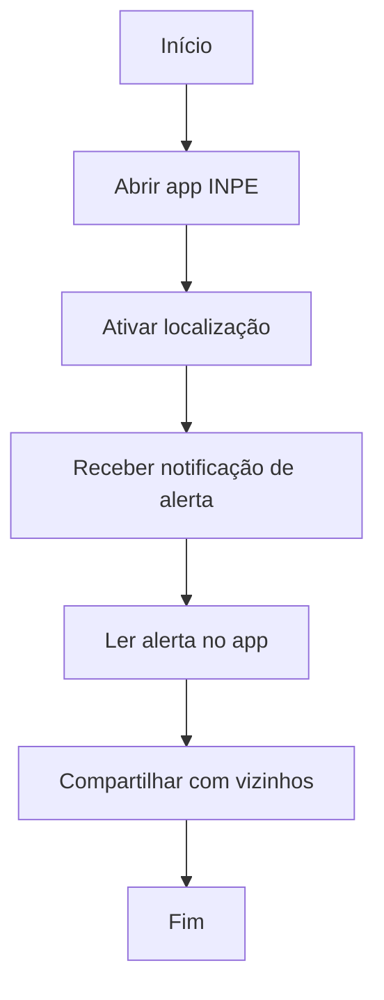

# Exercício 1 — Fluxo de Usuário (simples)
**Objetivo:** Receber alerta de enchente (Persona: Ana, 28).

```mermaid
flowchart TD
    A[Início] --> B[Abrir app INPE]
    B --> C[Ativar localização]
    C --> D[Receber notificação de alerta]
    D --> E[Ler alerta no app]
    E --> F[Compartilhar com vizinhos]
    F --> G[Fim]
```
